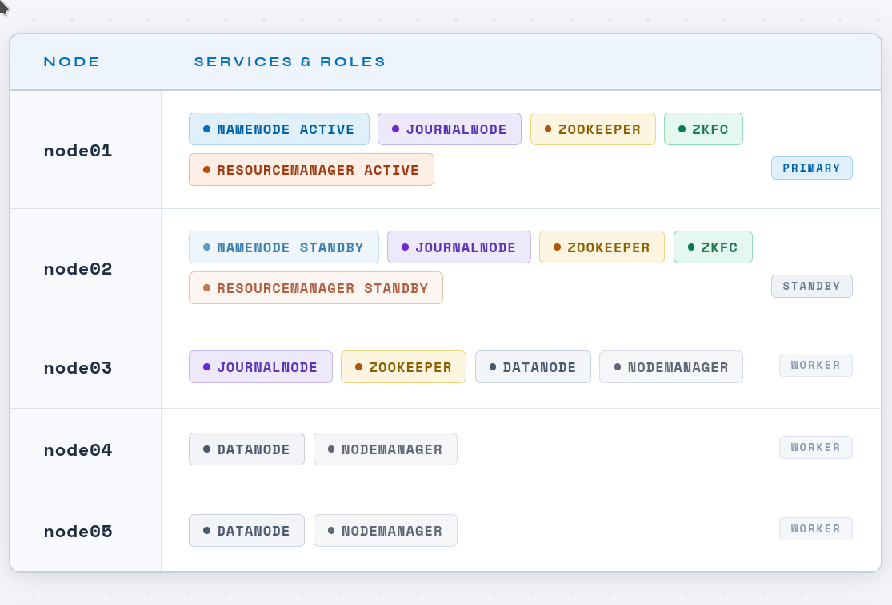
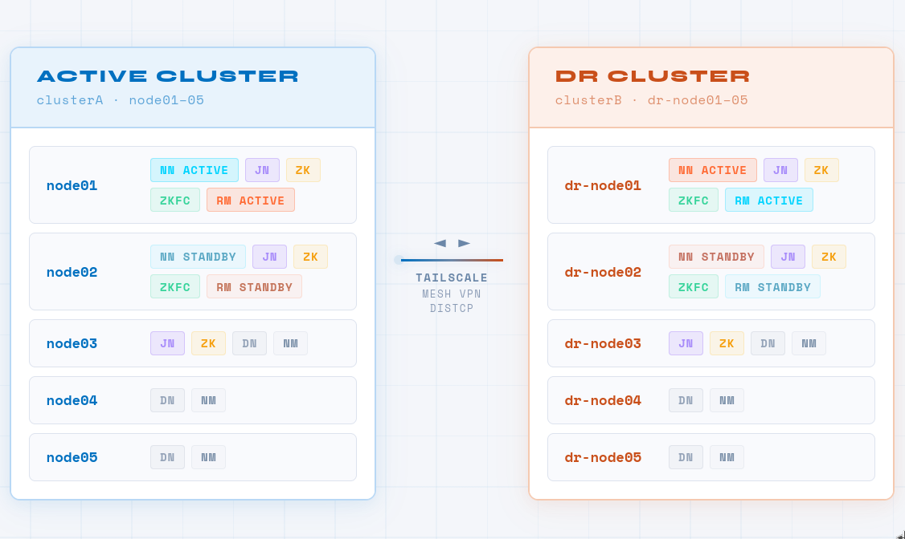

# Hadoop High Availability Cluster with Disaster Recovery

> A fully containerized, production-grade Hadoop HA pseudo-cluster with an integrated Disaster Recovery cluster — built on Docker, HDFS, YARN, and ZooKeeper.

---

## Table of Contents

1. [Project Overview](#1-project-overview)
2. [System Architecture](#2-system-architecture)
3. [Hadoop High Availability Explanation](#3-hadoop-high-availability-explanation)
4. [Disaster Recovery Architecture](#4-disaster-recovery-architecture)
5. [Technology Stack](#5-technology-stack)
6. [Cluster Node Breakdown](#6-cluster-node-breakdown)
7. [Service Breakdown](#7-service-breakdown)
8. [How the Cluster Boots](#8-how-the-cluster-boots)
9. [Setup Instructions](#9-setup-instructions)
10. [Cluster Verification](#10-cluster-verification)
11. [Conclusion](#11-conclusion)

---

## 1. Project Overview

### What This Project Is

This project provisions two complete, fully-functional **Hadoop High Availability (HA) clusters** using Docker containers — an **Active cluster** and a **Disaster Recovery (DR) cluster** — all running on a single host machine. It demonstrates how a production-grade distributed data platform can be simulated, automated, and validated in a local development environment.

Each cluster runs Hadoop 3.4.2 with:
- **HDFS HA** — dual NameNodes (Active + Standby) backed by a JournalNode quorum for shared edit log synchronization
- **YARN HA** — dual ResourceManagers (Active + Standby) with ZooKeeper-based state persistence
- **ZooKeeper** — a 3-node quorum providing distributed coordination, leader election, and ZKFC fencing
- **Automatic Failover** — via ZooKeeper Failover Controllers (ZKFC) on both NameNodes


### Problems It Solves

| Problem | Solution |
|---|---|
| Single NameNode is a single point of failure | Dual NameNode HA with automatic failover |
| Metadata loss on NameNode crash | JournalNode quorum keeps edit logs replicated |
| Entire cluster loss (datacenter failure) | A separate DR cluster mirrors the production cluster |
| Manual failover is slow and error-prone | ZKFC + ZooKeeper trigger automatic, sub-minute failover |
| Local cluster setup is complex and fragile | Dockerized, scripted, fully automated startup |

### Hadoop HA in This Context

In a standard Hadoop deployment, the NameNode manages all HDFS filesystem metadata. If it goes down, the entire cluster becomes unavailable. Hadoop HA solves this by running two NameNodes simultaneously: one **Active** (serving all client requests) and one **Standby** (continuously synchronized, ready to take over instantly). This project implements this pattern in Docker containers, with the host machine acting as the simulated datacenter and each container acting as a physical node.

### Disaster Recovery in This Context

The DR cluster is an independent, fully operational second Hadoop cluster. In a real-world scenario, it would be deployed in a geographically separate datacenter. Here it is accessible via **Tailscale VPN** (a mesh VPN overlay), allowing the DR cluster to be reachable from the Active cluster for cross-cluster data replication using Hadoop's built-in `DistCp` tool. If the Active cluster suffers a total failure, the DR cluster can be promoted and made available.

---

## 2. System Architecture

### Pseudo-Cluster Architecture
### PLACEHOLDER


Each Docker container simulates a physical server in a real Hadoop cluster. All containers share a Docker bridge network (`cluster-network`), enabling inter-node communication by hostname (`node01`, `node02`, etc.), just like a real distributed deployment with DNS resolution.

### Node Roles at a Glance



> The DR cluster mirrors this exact architecture. Only the container names, hostnames, Docker Compose configuration, and port mappings differ between the two clusters.


---

## 3. Hadoop High Availability Explanation

### Active vs Standby NameNode

Hadoop HA runs exactly **two NameNodes** at all times:

- **Active NameNode** (`node01`): Handles all filesystem operations — reads, writes, deletes, renames. It is the only NameNode that accepts mutations to the HDFS namespace.
- **Standby NameNode** (`node02`): Continuously replays the Active NameNode's edit log from the JournalNodes. It maintains an up-to-date in-memory copy of the filesystem state, ready to assume the Active role within seconds.

At no point are both NameNodes Active simultaneously — this is called a **split-brain** scenario and is prevented by fencing (configured in `hdfs-site.xml` as `shell(/bin/true)` for dev, and SSH/STONITH in production).

### JournalNode Quorum

The **JournalNode (JN) quorum** is the shared edit log mechanism that keeps the Standby NameNode synchronized:

- Every write operation on the Active NameNode is written to a **majority** of JournalNodes before being acknowledged.
- The Standby NameNode tails the JournalNode quorum and applies edits to its in-memory state continuously.
- A quorum of `2N+1` JournalNodes can tolerate `N` failures. This cluster uses **3 JournalNodes**, tolerating 1 failure.
- JournalNode data is stored at `/var/hadoop/journal` on each node, communicating on port `8485`.

### ZooKeeper Role

Apache ZooKeeper provides distributed coordination across the cluster:

- **Leader election**: Determines which NameNode should be Active.
- **Ephemeral znodes**: The Active NameNode holds a ZooKeeper lock (`znode`). If it dies, the znode disappears, triggering failover.
- **YARN RM state store**: The Active ResourceManager stores application state in ZooKeeper (`yarn.resourcemanager.zk-address`), so a standby RM can resume exactly where the active left off.
- The quorum runs on `node01:2181`, `node02:2181`, `node03:2181`, configured in `zoo.cfg` with `tickTime=2000`, `initLimit=10`, `syncLimit=5`.

### ZKFC Role

The **ZooKeeper Failover Controller (ZKFC)** is a daemon that runs on each NameNode host:

- Monitors the health of the local NameNode via periodic health checks.
- Maintains a ZooKeeper session. As long as the NameNode is healthy, the ZKFC holds a ZooKeeper lock.
- If the local NameNode fails, the ZKFC releases its lock, and the other ZKFC (on the standby node) acquires the lock and transitions its NameNode to Active.
- Before transitioning, ZKFC executes the configured **fencing method** to ensure the old Active NameNode is truly dead (`shell(/bin/true)` in this dev config).

## 4. Disaster Recovery Architecture

### Purpose of the DR Cluster

The DR cluster is a fully independent, operational Hadoop HA cluster that mirrors the Active cluster's architecture. Its purpose is to ensure **business continuity** in the event of a catastrophic failure of the Active cluster (e.g., host machine failure, datacenter outage, data corruption).

### Relationship Between Active and DR Clusters



The two clusters communicate over **Tailscale**, a peer-to-peer mesh VPN. The `extra_hosts` entries in `docker-compose.yml` map `dr-node01` and `dr-node03` to their Tailscale IPs (`100.115.195.121`), allowing the Active cluster nodes to resolve and reach DR cluster nodes by name.

### Replication and Recovery Design

Data replication from the Active cluster to the DR cluster is performed using **Hadoop DistCp** (Distributed Copy), which leverages MapReduce to copy HDFS data in parallel:

```bash
# Example DistCp from Active to DR
hadoop distcp hdfs://clusterA/data hdfs://dr-node01:8020/data
```

Key architectural points from the code:
- **Port 8020** (NameNode RPC) is exposed on `node01` (`8020:8020`) — this is the DistCp entry point for cross-cluster copy operations.
- **Port 9866** (DataNode transfer port) is exposed on `node03` (`9866:9866`) — DataNode-to-DataNode data transfer uses this port during DistCp.
- The DR cluster's NameNode (`dr-node01`) is reachable via Tailscale, making the DR HDFS accessible as a remote filesystem endpoint.

In a production scenario, DistCp would be scheduled via cron or an orchestration tool (Apache Oozie, Airflow) to replicate critical datasets on a defined RPO (Recovery Point Objective) schedule.

---

## 5. Technology Stack

| Component | Version | Role |
|---|---|---|
| **Docker** | 20.10+ | Container runtime — each container = one cluster node |
| **Docker Compose** | v3.9 | Multi-container orchestration |
| **Ubuntu** | 24.04 | Base OS for all containers |
| **Apache Hadoop** | 3.4.2 | Distributed storage (HDFS) and processing (YARN/MapReduce) |
| **HDFS** | 3.4.2 | Distributed filesystem with HA NameNode |
| **YARN** | 3.4.2 | Cluster resource manager with HA ResourceManager |
| **Apache ZooKeeper** | 3.8.6 | Distributed coordination and leader election |
| **OpenJDK** | 11 | Java runtime for all Hadoop/ZooKeeper daemons |
| **OpenSSH** | system | Inter-container communication for orchestration scripts |
| **dos2unix** | system | Windows CRLF → Unix LF line ending normalization |
| **netcat (nc)** | openbsd | Port liveness checks in startup health verification |
| **Tailscale** | — | Mesh VPN for cross-cluster (Active ↔ DR) connectivity |

---

---

## 6. Cluster Node Breakdown

### node01 — Primary Control Node

**Processes**: `NameNode` (Active), `JournalNode`, `QuorumPeerMain` (ZooKeeper), `DFSZKFailoverController` (ZKFC), `ResourceManager` (Active)

**Responsibilities**:
- Serves all HDFS client filesystem operations (open, create, delete, rename, list)
- Writes all metadata mutations to the JournalNode quorum
- Holds the ZooKeeper Active NameNode lock via ZKFC
- Manages YARN cluster resource allocation as the Active ResourceManager
- Acts as the cluster orchestration entry point (all startup scripts run from here)

**Key Ports**:
| Port | Service |
|---|---|
| `8020` | NameNode RPC (HDFS clients + DistCp) |
| `9870` | NameNode Web UI |
| `8088` | YARN ResourceManager Web UI |
| `8480` | JournalNode HTTP |
| `8485` | JournalNode RPC |
| `2181` | ZooKeeper client |

---

### node02 — High Availability Standby Node

**Processes**: `NameNode` (Standby), `JournalNode`, `QuorumPeerMain` (ZooKeeper), `DFSZKFailoverController` (ZKFC), `ResourceManager` (Standby)

**Responsibilities**:
- Continuously tails the JournalNode quorum and applies edits to maintain metadata parity with node01
- Monitors node01 NameNode health via ZKFC; takes over as Active upon failure
- Provides ResourceManager failover continuity via ZooKeeper state store
- Acts as a JournalNode participant in the 3-node quorum

**Key Ports**: Same as node01 — `8020`, `9870`, `8088`, `8485`, `2181`

---

### node03 — ZooKeeper Quorum Tie-Breaker + Worker

**Processes**: `QuorumPeerMain` (ZooKeeper), `JournalNode`, `DataNode`, `NodeManager`

**Responsibilities**:
- Provides the third ZooKeeper vote, preventing split-brain in the quorum
- Provides the third JournalNode, maintaining quorum fault tolerance
- Stores HDFS data blocks as a DataNode
- Executes YARN containers (MapReduce tasks, Spark executors, etc.) as a NodeManager
- Port `9866` is exposed to the host for DistCp DataNode-to-DataNode transfers from the DR cluster

---

### node04 — Worker Node

**Processes**: `DataNode`, `NodeManager`

**Responsibilities**:
- Stores HDFS data blocks (replication factor 1 in this dev setup)
- Executes YARN application containers

---

### node05 — Worker Node

**Processes**: `DataNode`, `NodeManager`

**Responsibilities**:
- Stores HDFS data blocks
- Executes YARN application containers

---

## 7. Service Breakdown

### NameNode

The brain of HDFS. Maintains the entire filesystem namespace in memory (file/directory tree, block-to-DataNode mappings). Does **not** store actual data — only metadata. In HA mode, two NameNodes share the namespace state via the JournalNode quorum, with only one being Active at any time.

- Config: `dfs.namenode.name.dir=/var/hadoop/namenode`
- RPC: port `8020`
- HTTP: port `9870`
- Started with: `hdfs --daemon start namenode`

### DataNode

Stores the actual HDFS data blocks on local disk. Reports block inventory to the NameNode via heartbeats and block reports. Serves data blocks directly to HDFS clients (bypassing the NameNode for data transfer).

- Config: `dfs.datanode.data.dir=/var/hadoop/datanode`
- Data transfer port: `9866`
- Started with: `hdfs --daemon start datanode`

### JournalNode

A lightweight daemon that forms a quorum-based shared edit log for HA NameNodes. The Active NameNode writes every edit to a majority of JournalNodes before returning success. The Standby NameNode reads from JournalNodes to stay synchronized.

- Config: `dfs.journalnode.edits.dir=/var/hadoop/journal`
- RPC: port `8485`
- HTTP: port `8480`
- Started with: `hdfs --daemon start journalnode`

### ZooKeeper

A distributed coordination service providing:
- Leader election for NameNode and ResourceManager HA
- Distributed lock management (Active NameNode holds an ephemeral znode)
- YARN ResourceManager state store (`yarn.resourcemanager.zk-address`)

- Config: `/opt/zookeeper/conf/zoo.cfg`
- Client port: `2181`
- Peer ports: `2888` (leader-follower), `3888` (leader election)
- Started with: `zkServer.sh start`

### ZKFC (ZooKeeper Failover Controller)

A Hadoop daemon that co-locates with each NameNode. It continuously health-checks the local NameNode. It maintains a ZooKeeper session and competes for an Active lock. When the Active NameNode's ZKFC loses health or connectivity, the standby ZKFC claims the lock and promotes its NameNode.

- Started with: `hdfs --daemon start zkfc`
- Initialized (ZK znode setup): `hdfs zkfc -formatZK -force`

### ResourceManager

The YARN master daemon. Accepts job submissions, negotiates container allocations with NodeManagers, tracks running applications, and schedules work across the cluster. In HA mode, two ResourceManagers run simultaneously — one Active (accepting work) and one Standby (monitoring via ZooKeeper). Failover is automatic and preserves in-flight application state.

- Web UI: port `8088`
- Started with: `yarn --daemon start resourcemanager`

### NodeManager

Runs on every worker node. Manages container lifecycles on that node — launching, monitoring, and killing YARN containers. Reports resource availability (CPU, memory) to the ResourceManager.

- Started with: `yarn --daemon start nodemanager`
- Required config: `yarn.nodemanager.aux-services=mapreduce_shuffle` for MapReduce shuffle operations

---

## 8. How the Cluster Boots

The entire startup sequence is orchestrated by `run-all.sh`, called from node01's `run.sh` entrypoint. The sequence is **strictly ordered** because each service depends on the previous layer being healthy.

### PLACEHOLDER

### Idempotency

The startup scripts are **idempotent** — they check for the existence of the `VERSION` file in the NameNode directory before formatting, and check for the bootstrapped state before bootstrapping the Standby. 
- This means `run-all.sh` can be safely re-run on a cluster that was previously started without corrupting metadata.

---

## 9. Setup Instructions

### Prerequisites

| Requirement | Minimum Version |
|---|---|
| Docker Desktop / Docker Engine | 20.10+ |
| Docker Compose | v2.x (Compose v3.9 spec) |
| Available RAM | 8 GB recommended (5 containers) |
| Available Disk | 10 GB for images + data |
| OS | Linux, macOS, or Windows (WSL2) |

### Step 1 — Clone the Repository

```bash
git clone <your-repo-url>
cd <project-root>
```

### Step 2 — Download Hadoop and ZooKeeper Tarballs

The Docker build requires the tarballs to be present in `./shared/` before building.

```bash
cd shared/
bash scripts/startup-shared.sh
```

This script downloads:
- `apache-zookeeper-3.8.6-bin.tar.gz` from Apache archives
- `hadoop-3.4.2.tar.gz` from Apache archives

If the files already exist, the script skips downloading.

### Step 3 — Build the Docker Image

```bash
docker compose build
```

This builds the `hadoop-cluster` image from the `Dockerfile`. The image is shared by all 5 containers. Building may take 3–5 minutes on first run.

### Step 4 — Start the Cluster

```bash
docker compose up -d
```

This starts all 5 containers. node01 will begin orchestrating the full cluster startup sequence automatically via `run.sh` → `run-all.sh`.

### Step 5 — Monitor Startup Progress

Follow node01 logs to watch the startup sequence:

```bash
docker logs -f node01
```

A successful startup will end with output similar to:

```
[HH:MM:SS] ==== CLUSTER HEALTH ====
[HH:MM:SS] nn1: active
[HH:MM:SS] nn2: standby
[HH:MM:SS] rm1: active
[HH:MM:SS] rm2: standby
Live datanodes (3):
[HH:MM:SS] node01: NameNode JournalNode QuorumPeerMain DFSZKFailoverController ResourceManager
[HH:MM:SS] node02: NameNode JournalNode QuorumPeerMain DFSZKFailoverController ResourceManager
[HH:MM:SS] node03: DataNode JournalNode QuorumPeerMain NodeManager
[HH:MM:SS] node04: DataNode NodeManager
[HH:MM:SS] node05: DataNode NodeManager
```

### Step 6 — Access Web UIs

| Service | URL | Node |
|---|---|---|
| HDFS NameNode (Active) | http://localhost:9871 | node01 |
| HDFS NameNode (Standby) | http://localhost:9872 | node02 |
| YARN ResourceManager | http://localhost:8081 | node01 |
| YARN ResourceManager (Standby) | http://localhost:8082 | node02 |
| JournalNode HTTP (node01) | http://localhost:8481 | node01 |
| JournalNode HTTP (node02) | http://localhost:8482 | node02 |
| JournalNode HTTP (node03) | http://localhost:8483 | node03 |

### Step 7 — Stop the Cluster

```bash
docker compose down
```

To also remove named volumes (NameNode metadata and ZooKeeper data — **destructive**):

```bash
docker compose down -v
```

---

## 10. Cluster Verification

### Verify HDFS is Working

```bash
# Enter node01
docker exec -it node01 bash

# Check HDFS NameNode HA states
hdfs haadmin -getServiceState nn1
hdfs haadmin -getServiceState nn2

# Full cluster report
hdfs dfsadmin -report

# List root filesystem
hdfs dfs -ls /

# Create a test directory and file
hdfs dfs -mkdir -p /test
echo "hello hadoop" | hdfs dfs -put - /test/hello.txt
hdfs dfs -cat /test/hello.txt
```

### Verify YARN is Working

```bash
# Check YARN RM HA states
yarn rmadmin -getServiceState rm1
yarn rmadmin -getServiceState rm2

# List YARN nodes
yarn node -list

# Run the built-in MapReduce pi estimation example
yarn jar /opt/hadoop/share/hadoop/mapreduce/hadoop-mapreduce-examples-3.4.2.jar pi 4 100
```

### Verify HA is Functioning

```bash
# Check both NameNode states
hdfs haadmin -getServiceState nn1   # Should return: active
hdfs haadmin -getServiceState nn2   # Should return: standby

# Check HA status detail
hdfs haadmin -getAllServiceState

# Check ZKFC health
hdfs zkfc -checkHealth
```

### Verify JournalNode Quorum

```bash
# Check JournalNode port on all 3 nodes
for node in node01 node02 node03; do
  docker exec $node nc -z localhost 8485 && echo "$node: JournalNode UP" || echo "$node: JournalNode DOWN"
done

# Check JournalNode via HTTP (from host)
curl -s http://localhost:8481/jmx | grep -i "journalnode"
```

### Verify ZooKeeper Quorum

```bash
# Check ZooKeeper status on all 3 nodes
for node in node01 node02 node03; do
  docker exec $node /opt/zookeeper/bin/zkServer.sh status 2>/dev/null | grep -E "Mode|node"
done

# Use 4-letter word commands
docker exec node01 bash -c "echo ruok | nc localhost 2181"   # Should return: imok
docker exec node01 bash -c "echo stat | nc localhost 2181"   # Shows leader/follower mode
```

---

## 11. Conclusion

This project demonstrates a **production-grade Hadoop HA architecture** implemented entirely in Docker containers, suitable for development, testing, and learning. It covers the full spectrum of a real-world distributed data platform:


**Architecture Takeaways**:

The pseudo-cluster pattern (host = datacenter, container = node) is a powerful way to develop, test, and validate distributed system configurations before deploying to physical or cloud infrastructure. 

The startup scripts in this project are directly portable to real multi-host deployments — only the SSH targets and volume paths need to change.

This project serves as a complete reference implementation for anyone building or learning Hadoop HA clusters, and provides a solid foundation for adding higher-level tools such as Apache Hive, Spark, HBase, or any other tool on top of the HA HDFS/YARN base.

---

Built with ❤️ by **[Salah](https://www.linkedin.com/in/salah-algamasy/)** and **[Waheed](https://www.linkedin.com/in/ahmedwaheedmobarez/)**